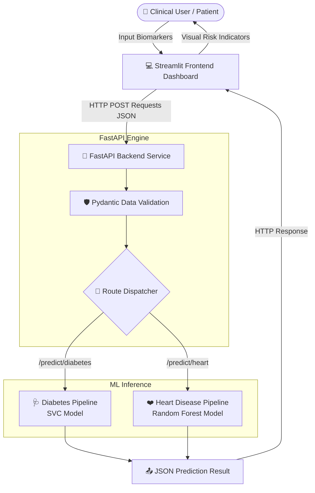

# 🩺 DoctorMD — Multi-Disease Prediction System (DoctorMD)

[](https://www.python.org/)
[](https://fastapi.tiangolo.com/)
[](https://streamlit.io/)
[](https://scikit-learn.org/)
[](https://github.com/venkataganesh22/DoctorMD)

**DoctorMD** is an end-to-end Machine Learning web application designed to perform early-stage risk assessment for multiple chronic health conditions, specifically **Heart Disease** and **Diabetes**. 

The system leverages optimized Scikit-learn machine learning pipelines exposed via a robust **FastAPI** REST backend and presented through an interactive, user-friendly **Streamlit** clinical interface.

---

## 📑 Table of Contents

- [Key Features](#-key-features)
- [System Architecture](#-system-architecture)
- [Machine Learning Pipelines](#-machine-learning-pipelines)
  - [1. Diabetes Prediction Pipeline](#1-diabetes-prediction-pipeline)
  - [2. Heart Disease Prediction Pipeline](#2-heart-disease-prediction-pipeline)
- [Repository Structure](#-repository-structure)
- [Clinical Feature Dictionary](#-clinical-feature-dictionary)
- [Installation & Setup](#-installation--setup)
- [Running the Application](#-running-the-application)
- [API Reference & Documentation](#-api-reference--documentation)
- [Medical Disclaimer](#-medical-disclaimer)


---

## ✨ Key Features

- **Multi-Disease Diagnostic Support**: Dedicated risk assessment workflows for both cardiovascular conditions and diabetes.
- **Microservice Architecture**: Decoupled architecture with a high-performance FastAPI backend service and a responsive Streamlit frontend client.
- **Strict Data Validation**: Pydantic schemas enforce physiological boundary checks and data integrity at the API layer.
- **Optimized Preprocessing**: Automated handling of missing/zero values and feature scaling using Scikit-learn pipelines to prevent data leakage.
- **Interactive UI**: Real-time diagnostic risk assessment with contextual feedback, field validations, and medical guidance.
- **Comprehensive EDA Notebooks**: Fully documented research notebooks detailing Exploratory Data Analysis, feature engineering, model benchmarking, and hyperparameter tuning.

---

## 🏗️ System Architecture



---

## 🔬 Machine Learning Pipelines

### 1. Diabetes Prediction Pipeline
- **Dataset**: Pima Indians Diabetes Database (`dataset/diabetes.csv` — 768 patient records).
- **Core Challenge**: Physiological zeros (e.g., zero blood pressure, zero insulin) representing missing clinical measurements.
- **Pipeline Architecture**:
  - `ColumnTransformer` applying `SimpleImputer(strategy='median')` to handle physiological missingness.
  - `StandardScaler()` for zero-mean, unit-variance standardization.
  - **Estimator**: `SVC(C=1, class_weight='balanced', random_state=42)`.
- **Evaluation Performance**:
  - **Train Accuracy**: ~81.76%
  - **Test Accuracy**: ~70.13%
  - **Sensitivity / Recall (Class 1 - Diabetic)**: ~78% on unseen test data.

### 2. Heart Disease Prediction Pipeline
- **Dataset**: Comprehensive Heart Disease Dataset (`dataset/heart.csv` — 1,025 clinical observations).
- **Features**: 13 key clinical features including ECG results, ST depression, resting blood pressure, chest pain types, and thallium stress test results.
- **Pipeline Architecture**:
  - `StandardScaler()` feature scaling.
  - **Estimator**: `RandomForestClassifier(n_estimators=1119, max_depth=5, min_samples_split=30, min_samples_leaf=11, n_jobs=-1, random_state=42)`.
- **Evaluation Performance**:
  - **Train Accuracy**: ~91.25%
  - **Test Accuracy**: ~81.41%
  - **Sensitivity / Recall (Class 1 - Heart Disease)**: ~90% on unseen test data.

---

## 📂 Repository Structure

```text
DoctorMD/
├── backend/
│   └── main.py                     # FastAPI backend application & endpoints
├── frontend/
│   └── app.py                      # Streamlit interactive web interface
├── dataset/
│   ├── diabetes.csv                # Pima Indians diabetes dataset
│   └── heart.csv                   # Heart disease clinical dataset
├── models/
│   ├── diabetes_model.pkl          # Serialized trained SVC pipeline
│   └── heart_disease_model.pkl     # Serialized trained Random Forest pipeline
├── notebook_dir/
│   ├── 1_diabetes_prediction_using_ml.ipynb     # Diabetes EDA & Model Training
│   └── 2_heart_disease_prediction_with_ml.ipynb # Heart Disease EDA & Model Training
├── .gitignore                      # Git ignore file
├── requirements.txt                # Project Python dependencies
└── README.md                       # Project documentation
```

---

## 🩺 Clinical Feature Dictionary

### Heart Disease Features (`/predict/heart`)

| Feature | Type | Range / Values | Description |
| :--- | :--- | :--- | :--- |
| `age` | Integer | 1 – 120 | Patient age in years |
| `sex` | Categorical | `0` = Female, `1` = Male | Biological sex of the patient |
| `cp` | Categorical | `0` – `3` | Chest pain type (Typical angina, Atypical, Non-anginal, Asymptomatic) |
| `trestbps` | Integer | 80 – 200 mm Hg | Resting blood pressure |
| `chol` | Integer | 100 – 600 mg/dl | Serum cholesterol level |
| `fbs` | Binary | `0` = No, `1` = Yes | Fasting blood sugar > 120 mg/dl |
| `restecg` | Categorical | `0` – `2` | Resting electrocardiographic results |
| `thalach` | Integer | 60 – 220 bpm | Maximum heart rate achieved |
| `exang` | Binary | `0` = No, `1` = Yes | Exercise-induced angina |
| `oldpeak` | Float | 0.0 – 10.0 | ST depression induced by exercise relative to rest |
| `slope` | Categorical | `0` – `2` | Slope of the peak exercise ST segment |
| `ca` | Integer | `0` – `4` | Number of major vessels colored by fluoroscopy |
| `thal` | Categorical | `0` – `3` | Thalassemia category (Normal, Fixed defect, Reversible defect) |

### Diabetes Features (`/predict/diabetes`)

| Feature | Type | Range / Values | Description |
| :--- | :--- | :--- | :--- |
| `Pregnancies` | Integer | 0 – 20 | Number of times pregnant |
| `Glucose` | Float | 0.0 – 300.0 mg/dL | Plasma glucose concentration (2 hrs in OGTT) |
| `BloodPressure` | Float | 0.0 – 200.0 mm Hg | Diastolic blood pressure |
| `SkinThickness` | Float | 0.0 – 100.0 mm | Triceps skin fold thickness |
| `Insulin` | Float | 0.0 – 900.0 μU/mL | 2-Hour serum insulin |
| `BMI` | Float | 0.0 – 70.0 kg/m² | Body Mass Index |
| `DiabetesPedigreeFunction` | Float | 0.0 – 3.0 | Diabetes pedigree score (genetic history metric) |
| `Age` | Integer | 1 – 120 | Patient age in years |

---

## ⚙️ Installation & Setup

### Prerequisites
- **Python 3.10+** (Recommended: Python 3.11 or 3.12)
- **Git**

### 1. Clone Repository
```bash
git clone https://github.com/venkataganesh22/DoctorMD.git
cd DoctorMD
```

### 2. Create and Activate Virtual Environment
- **Windows (PowerShell)**:
  ```powershell
  python -m venv .venv
  .venv\Scripts\Activate.ps1
  ```
- **macOS / Linux**:
  ```bash
  python3 -m venv .venv
  source .venv/bin/activate
  ```

### 3. Install Dependencies
```bash
pip install -r requirements.txt
```

---

## 🚀 Running the Application

To run the complete system, you must start both the **FastAPI backend** and the **Streamlit frontend**.

### Step 1: Start the Backend API
In your first terminal window, start the Uvicorn server:
```bash
uvicorn backend.main:app --reload --port 8000
```
> The API will be accessible at: `http://127.0.0.1:8000`  
> Interactive Swagger UI docs: `http://127.0.0.1:8000/docs`

### Step 2: Start the Frontend UI
In a second terminal window (with virtual environment activated):
```bash
streamlit run frontend/app.py
```
> The web interface will open automatically in your browser at: `http://localhost:8501`

---

## 🔌 API Reference & Documentation

FastAPI provides automated, interactive API documentation accessible via:
- **Swagger UI**: [http://127.0.0.1:8000/docs](http://127.0.0.1:8000/docs)
- **ReDoc**: [http://127.0.0.1:8000/redoc](http://127.0.0.1:8000/redoc)

### Endpoints Overview

#### 1. System Health Check
- **Endpoint**: `GET /`
- **Response**:
  ```json
  {
    "message": "Multi Disease Prediction API is running 🚀"
  }
  ```

#### 2. Heart Disease Prediction
- **Endpoint**: `POST /predict/heart`
- **Request Body**:
  ```json
  {
    "age": 55,
    "sex": 1,
    "cp": 2,
    "trestbps": 130,
    "chol": 240,
    "fbs": 0,
    "restecg": 1,
    "thalach": 150,
    "exang": 0,
    "oldpeak": 1.2,
    "slope": 1,
    "ca": 0,
    "thal": 2
  }
  ```
- **Response**:
  ```json
  {
    "disease": "heart",
    "prediction": 1
  }
  ```

#### 3. Diabetes Prediction
- **Endpoint**: `POST /predict/diabetes`
- **Request Body**:
  ```json
  {
    "Pregnancies": 2,
    "Glucose": 130.0,
    "BloodPressure": 75.0,
    "SkinThickness": 25.0,
    "Insulin": 110.0,
    "BMI": 28.4,
    "DiabetesPedigreeFunction": 0.45,
    "Age": 42
  }
  ```
- **Response**:
  ```json
  {
    "disease": "diabetes",
    "prediction": 0
  }
  ```

---

## ⚠️ Medical Disclaimer

> **IMPORTANT**: This application is developed strictly for **educational and research purposes**. The predictions generated by these machine learning models are based on statistical patterns and should **NOT** be used as a replacement for professional clinical diagnosis, medical advice, or treatment. Always consult a licensed healthcare professional for medical concerns and formal diagnosis.

---

## 📄Acknowledgements
- **Datasets**: Built using public benchmark datasets (Pima Indians Diabetes & UCI Heart Disease repositories).
- **Author**: [@venkataganesh22](https://github.com/venkataganesh22)
